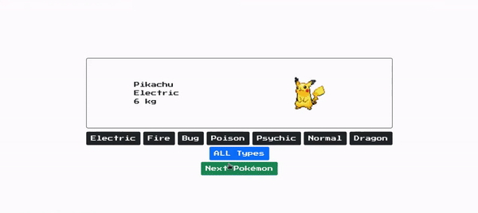

# Mini pokédex
Exercicio feito enquanto estudava na [Trybe](https://www.betrybe.com/), utilizando HTML, Sass, Bootstrap e React no módulo de front-end.

## Direitos autorais

Esse projeto foi desenvolvido por mim ([Matheus Gomes](https://www.linkedin.com/in/matheusgb/)) apenas visando o aprendizado.